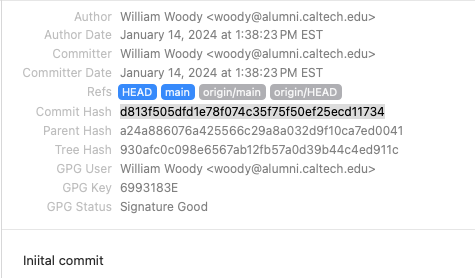
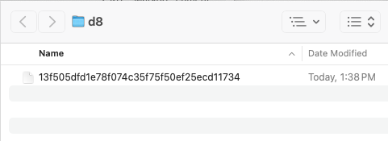

# GIT Commit objects

As mentioned [elsewhere](objecttypes.md), a commit object represents a [commit operation](https://git-scm.com/docs/git-commit). When you commit your changes in git, *presumably* a new collection of objects are constructed wich represent the current state of your source kit. (If objects or directories have not changed, then references to the unchanged objects are used.) The new root tree object is then stored in the commit, along with the parent object (or objects) that were used as the starting point of the changes (such as a merge operation), and a new commit object is then constructed.

Where the current commit object is stored, along with the current list of other objects is beyond the scope of my investigations. However, [there is some good documentation here](https://git-scm.com/book/en/v2/Git-Internals-Git-References) as to how commit object references are stored to track the current list of branches and the current 'head' branch. (Most of the files referred to in that documentation are short text files and can be easily inspected.)

## Commit Object storage

Our commit object is stored as type 'commit', meaning when stored in our object file as a single object, [the decompressed file will have the header](objectstorage.md)

    commit (size)\0

Following the null character is the contents of our commit itself.

## Commit data format

The commit data itself is stored as a text file. For example, second commit in this repository was committed with the following:

    tree 930afc0c098e6567ab12fb57a0d39b44c4ed911c
    parent a24a886076a425566c29a8a032d9f10ca7ed0041
    author William Woody <woody@alumni.caltech.edu> 1705257503 -0500
    committer William Woody <woody@alumni.caltech.edu> 1705257503 -0500
    gpgsig -----BEGIN PGP SIGNATURE-----
     
     iQIzBAABCAAdFiEEHpCA320AYSUkcKap+odwLGmTGD4FAmWkKh8ACgkQ+odwLGmT
     GD4FUw//TmKHEGBQ/3H8hqBIgptqXE3gbNwHFLhYshvobGk+qYj9w8J/EuB5gpqO
     JtANSPDLGV+AC61+pU/WSvnXy9znT0R0pxGGQipB/MKNMg7epGfxwv0Q8FxBO3Lp
     lt4YGyFroOGbhvYAFi9fHvMDmO9vcvAwVMkK3Zyb9osI0gs2rOMCxpDdn2UgorCG
     sofSZRD9uzXYehkxwEjEGbi38EMJm5X6rndvzJnmZFdU4Kjkb1EUB06N69iCo2DB
     satMZW6jgWEtVJgJ1hHa3Hyl59r4IuGK5EbGO7OQ4KT6IncKnDUXEu9+5q2adh1Z
     ny0/2n0kFg8P2YCHCm3xdo0ZbzlyaR3eSaKxUaHOid5l3KsX/XrCfyGb5lfsXzmC
     NlxoWjyzmsOJJnHnf6Mcf+DSRHU+4UzJ51EqjmXfN2F8wTaGMg4uzujmHozhi3/F
     e+yKRIgwIpRdUDpcuPyRwcMjBKnTJdK2CFmDHbML49E/doUduNugwP8XKX6kxz36
     HUhfWxpVfzNUyNlNZs36eOuKw8xVgRNSXp9QNzSGrzUlCkCMgiZWr5kg94SUwmzD
     tclK/RtGZ2eY04ZJas3tu5XshlL1kxjqT7HpeJ7JP4Dp8vk047GOdi5nUd8K7dQm
     X2IA8V2ZKaMA6hjPza9+vNDesYKB/M9Yv23wlJA6wmhDi9ySRas=
     =+K/I
     -----END PGP SIGNATURE-----
    
    Iniital commit

    Also used as an example in the discussion about commits.

    Signed-off-by: William Woody <woody@alumni.caltech.edu>

(Pardon my spelling.)

The SHA-1 hash of this object is `d813f505dfd1e78f074c35f75f50ef25ecd11734.` This becomes important below.

### Commit data header

Both the commit file (and the [tag file](tags.md)) start with a header, then a single empty line, then the text contents of the commit.

The header itself starts with a key (in the above, `tree`, `parent`, `author`, `committer` and `gpgsig` are all present), followed by a single whitespace, then a block of text.

Each line that follows that starts with a single space is concatenated (less the extra space)
to the prior line. Thus, the contents of the key 'gpgsig' is:

    -----BEGIN PGP SIGNATURE-----
     
    iQIzBAABCAAdFiEEHpCA320AYSUkcKap+odwLGmTGD4FAmWkKh8ACgkQ+odwLGmT
    GD4FUw//TmKHEGBQ/3H8hqBIgptqXE3gbNwHFLhYshvobGk+qYj9w8J/EuB5gpqO
    JtANSPDLGV+AC61+pU/WSvnXy9znT0R0pxGGQipB/MKNMg7epGfxwv0Q8FxBO3Lp
    lt4YGyFroOGbhvYAFi9fHvMDmO9vcvAwVMkK3Zyb9osI0gs2rOMCxpDdn2UgorCG
    sofSZRD9uzXYehkxwEjEGbi38EMJm5X6rndvzJnmZFdU4Kjkb1EUB06N69iCo2DB
    satMZW6jgWEtVJgJ1hHa3Hyl59r4IuGK5EbGO7OQ4KT6IncKnDUXEu9+5q2adh1Z
    ny0/2n0kFg8P2YCHCm3xdo0ZbzlyaR3eSaKxUaHOid5l3KsX/XrCfyGb5lfsXzmC
    NlxoWjyzmsOJJnHnf6Mcf+DSRHU+4UzJ51EqjmXfN2F8wTaGMg4uzujmHozhi3/F
    e+yKRIgwIpRdUDpcuPyRwcMjBKnTJdK2CFmDHbML49E/doUduNugwP8XKX6kxz36
    HUhfWxpVfzNUyNlNZs36eOuKw8xVgRNSXp9QNzSGrzUlCkCMgiZWr5kg94SUwmzD
    tclK/RtGZ2eY04ZJas3tu5XshlL1kxjqT7HpeJ7JP4Dp8vk047GOdi5nUd8K7dQm
    X2IA8V2ZKaMA6hjPza9+vNDesYKB/M9Yv23wlJA6wmhDi9ySRas=
    =+K/I
    -----END PGP SIGNATURE-----

That is, each line following the line containing 'gpgsig' consists of a single space, then a line of text (though the line after the start of the signature is simply a single space followed by a newline).

Following that, a single blank line marks the end of the header and the start of the 'message'; in this case, the commit message.

Then my ill informed attempt at writing a commit message.

Sample code (in Java) that reads a single header line:

    public Header readHeader() throws IOException
    {
        if (atEOH) return null;

        /*
         *  Read the first line, if not already in our buffer
         */

        if (null == lastLine) {
            lastLine = reader.readLine();
        }

        // Are we at the end of all of this?
        if (lastLine.isEmpty()) {
            atEOH = true;
            return null;
        }

        // Now start concatenating the lines. We trim the leading space but
        // append a newline at the end of the line before concatenating

        StringBuilder builder = new StringBuilder();
        builder.append(lastLine);

        for (;;) {
            lastLine = reader.readLine();
            if (null == lastLine) {
                atEOH = true;
                break;
            }
            if (!lastLine.isEmpty() && (lastLine.charAt(0) == ' ')) {
                builder.append('\n');
                builder.append(lastLine.substring(1));
            } else {
                break;
            }
        }

        // Parse the header by finding the first space
        int index = builder.indexOf(" ");
        String headerName = builder.substring(0, index);
        String headerValue = builder.substring(index + 1);

        return new Header(headerName, headerValue);
    }

In the code above, 'atEOH' tracks if we reached the end of the header lines.

### Author/Committer Format

The format of the author and committer line is:

    (name) (sp) '<' (email) '>' (sp) (timestamp) (timezone)

The name is the name of the person associated with this commit, and may not contain any '<' characters. The e-mail is a standard e-mail address, and may not contain any '>' characters. The timestamp is the time when this was submitted, in seconds from the [Unix epoch.](https://www.epochconverter.com), and the timezone is represented as '+/-'HHMM. (I'm unaware if other timezone designators can be used here.)

### Commit SHA-1

The message's SHA-1 hash is then calculated, and that becomes both the object reference for the object storing this commit, and the hash tracked by tools like GIT-Tower to show the current commit:

And the file shows up in our object directory right where we would expect it:

### Required Commit Header Objects

It appears the commit message requires the following:

- `tree` A reference to the [tree object](trees.md) which represent the top level directory of the committed source kit. This will change as we modify our files, as any modified file in our tree structure will have a different name--and that will permeate upwards with the hashes of the tree structures contained in our source kit.
- `parent` A reference to the prior commit (or commits, in a merge) that this commit changed. *Note: the parent commit is omitted with the very first initial commit of a GIT repo.*
- `author` The author who owns this repository.
- `committer` The committer wo created this commit file.

Other keys may be present, such as `gpgsig`. I did not investigate the full range of keys that may be available.

I also did not really investigate the difference between the 'author' and the 'committer.' In a private repository it's really a difference without a difference. I suspect 'author' really means' owner' and may be, for example, the company who owns the repository.

### The commit message

Following the header is a single blank line, then the plain text of the commit message. Tools such as GIT-Tower may provide two lines to specify a commit message (a subject and a message), but it all gets stored as a single block of text.

