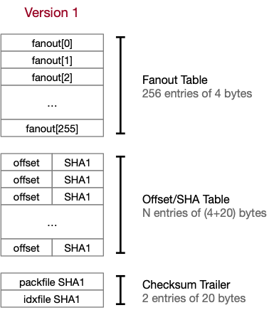
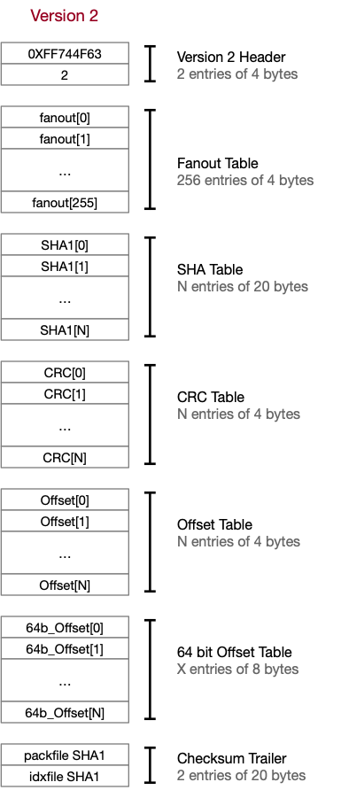

# The Packfile Index

The packfile index (pack-(SHA1).idx) stores a series of bookmarks that allow you to find a particular file within the packfile itself. As with the object files, files stored within our index are identified by their SHA-1 20-byte checksum.

[Packfile indexes are very well described here.](https://shafiul.github.io//gitbook/7_the_packfile.html)

There are two versions of the packfile index, version 1 (the default in GIT earlier than 1.6) and version 2 files, produced by versions if GIT later than this.

Neither index files are compressed.

## Version 1 files

Version 1 files start with a 1024 byte 'fanout' table. The table helps us navigate to the range of indexes in the offset/SHA table where our SHA-1 object identifier is located.

In order to identify an object's position in our index table we first extract the first byte of the 20 byte SHA-1 that identifies our object. This byte becomes the index used in our fanout table.

Call this first byte `B`.

If `B == 0`, then the index of the first object to search in our table is `0`. Othewise, the index if the first object is `fanout[B-1]`. The index at `fanout[B]` is one past the last index to search in.

This means the total size of our offset table, `N` is `fanout[255]`. This also means if the starting and ending indexes are the same, there is nothing to search for and our algorithm can halt.

Objects stored in our table are also sorted in ascending order by SHA1 object value. This means once we have our index range we can use a binary serach algorithm to quickly find the desired key in O(log(N)) compares, with N being the number of entries to search in our range.

An example of the code that does this (for both Version 1 and Version 2 files):

    private int binarySearch(byte[] sha1Bytes, int min, int max) throws IOException
    {
        byte[] sha1 = new byte[20];

        while (min < max) {
            int mid = (min + max) / 2;

            /*
             *  Get the SHA1 key, depending on the version. This requires we
             *  read data from our file.
             */

            long fileOffset;
            if (version == 1) {
                /*
                 *  Each item is 'offset' (4 bytes) + 'sha1' (20 bytes)
                 */

                fileOffset = 4 + offsetStart + (mid * 24);
            } else {

                /*
                 *  Each item is 'sha1' (20 bytes)
                 */
                fileOffset = offsetStart + (mid * 20);
            }
            file.seek(fileOffset);
            file.read(sha1);
            int cmp = Hex.compare(sha1Bytes, sha1);

            if (cmp < 0) {
                max = mid;
            } else if (cmp > 0) {
                min = mid + 1;
            } else {
                return mid;
            }
        }
        return -1;
    }

The end result of this search process is a 4-byte offset into our pack file. How this is used is in the section on the [pack file format.](pack.md).

### Fanout entries

Fanout entires in our fanout table are stored as 4-byte integers in network order. That is, the byte sequence `00 00 00 01` represents the number 1.

### Offset/SHA entries

Offsets and SHA records are stored next to each other as 24-byte records in the Offset/SHA table. SHA records are the names of the objects represented in this pack file, and the offsets are the offset *in bytes* into our pack file where the data is stored. Offsets are stored in network order as 4-byte integers, and the SHA records are stored as 20 byte records.

### Checksum trailer

The trailer of our file contains 2 20-byte SHA1 checksums.

The first is the packfile checksum. This is the checksum of the packfile (as described [in our section on the packfile format](pack.md)), and can be used to validate the packfile. The SHA1 record should also match the file name used to name this index file.

The second is the index file checksum. To calculate the index file checksum, you calculate the SHA-1 checksum of all *but the last 20 bytes* of our index file. This should then match the SHA-1 chekcsum in the last 20 bytes of our file.

This gives us two ways to verify our index file:

1. Does the file name match the SHA-1 checksum of the associated file? (That is, is our index file name pack-(SHA1).idx, where (SHA1) matches the packfile SHA1 stored in our trailer?)
2. Does the file SHA1 checksum match the stored checksum in our file?

Of course we can also validate that the matching pack-(SHA1).pack file also exists.

## Version 2 files

Version 2 extends the version 1 file by adding two new features:

- CRC checksums of the data stored in our packfiles. This is the CRC checksum *of the compressed data in our packfile*, which allows the data in a packfile to be validated without being decompressed, permitting us to copy data out of a packfile and into another without needing to decompress the file to validate it.
- Version 2 files can represent files larger than 2gb in size.

We determine if a file is a Version 1 or Version 2 file by reading the first 8 bytes of the file. If the first 4 bytes (in network byte order) matches the constant `0xFF744F63`, then the second word equals the version of this file: 2, in network byte order.

**NOTE:** In a version 1 file, the sequence `0xFF744F63, 2` **CANNOT** appear in a properly formatted fanout file. Values in the fanout file should be in strictly ascending order.

Following the header is the fanout table, as before.

Following the fanout table are **three** separate tables, the SHA table giving the object identifiers (SHA-1 checksums) of the objects to search for, followed by the CRC checksum table of the *compressed* pack data, then the offset table.

Note entries in the offset table can either be

1. Byte offsets into our pack file.
2. If the MSB of the 4-byte word is set to 1, then the rest of the value is an index into the 64-bit offset table.

(Thus, `0x80000002` indicates 64b_Offset[2] contains the 8-byte offset into our pack file of the stored object data.)

The 64-bit offset table may not be present in our pack file if the pack file itself is less than 2gb in size.

### Entry byte order

As noted above, all integers stored in our packfile are stored in network byte order. SHA-1 records as 20-byte values. And our 8-byte offsets are stored in network byte order as well.

### Checksum trailer

The trailer of our version 2 file works exactly the same as with our version 1 file, and we can validate our version 2 file in exactly the same way.
