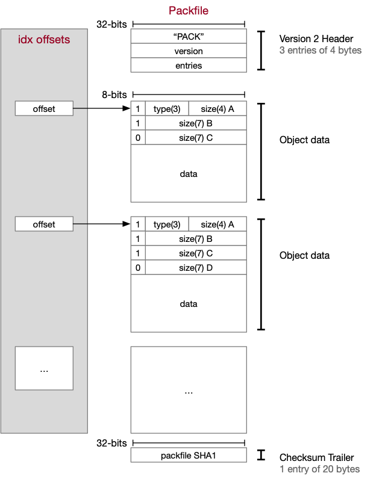
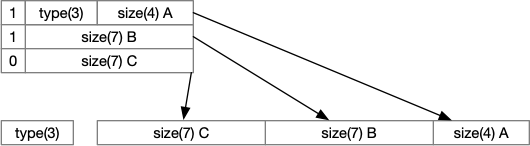
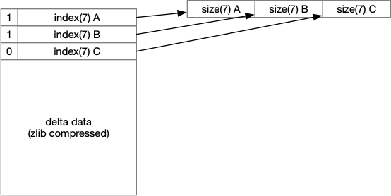
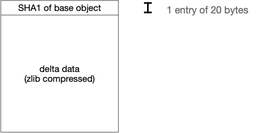
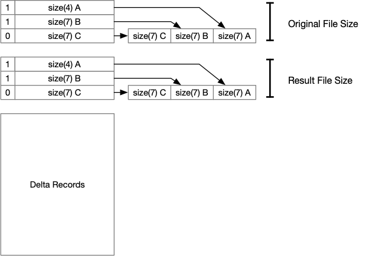
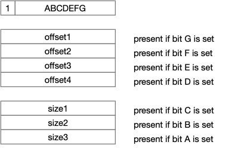
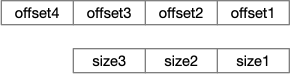
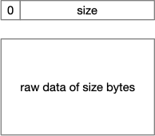

# Pack files

> Pack files are where I pulled my hair out because the documentation does not seem terribly complete here. It's the hair pulling that motivated me to create this Github repository in the first palace.

Pack files are sort of described [here.](https://shafiul.github.io//gitbook/7_the_packfile.html)

Our pack file begins with a 12 byte header.

The first four bytes are the four characters 'PACK'.

The next four bytes is the version of the pack file, in network byte order. The version must be either 2 or 3; both appear to refer to the same file format, and modern GIT implementations appear to write 2 as the version number.

The last four bytes is the number of objects that are packaged in this pack file.

For example, the following header describes a pack file with six objects encoded in it:

    00000000:  50 41 43 4B 00 00 00 02  00 00 00 06 .. .. .. .. 
               ^^^^^^^^^^^ -- PACK
                           ^^^^^^^^^^^ -- Version 2
                                        ^^^^^^^^^^^ -- 6 objects stored

Following this are N blocks of data, each representing an object, similar to the object files [described elsewhere](objectstorage.md). However, instead of a text header, the prefix before our data is encoded as two integers with variable length format.

The encoding used in this format is as follows:

1. If the MSB of the 8-bit byte is 0, then we have reached the end of our value.
2. The first byte contains the type as a 3-bit prefix, and the size as 4 bits.
3. As each byte is read that follows, the bottom 7 bits are added ot the size of our integer. Each subsequent 7-bits represent the next higher 7 bits in our value.

Graphically:

And in code:

    private ObjectHeader readOffset() throws IOException
    {
        int ch;
        int shift;
        byte type;
        long size = 0;

        /*
         *  Read the first byte
         */

        ch = file.read();
        type = (byte)(0x07 & (ch >> 4));
        size = (ch & 0x0f);

        /*
         *  Read the rest of the bytes
         */
        
        shift = 4;
        while ((ch & 0x80) != 0) {
            ch = file.read();
            size |= (long)(ch & 0x7f) << shift;
            shift += 7;
        }

        return new ObjectHeader(ObjectType.fromByte(type), size);
    }

*(Error handling has been removed from the above for clarity.)*

## Pack File Types

As noted [elsewhere](objecttypes.md), there are only 4 types of object files stored in our object directory.

Rather than represent the object types as text, we represent them as an integer type. 

We also add two new types, that can only appear in a pack file, to the list of types. They--and the integer value in the `type` field representing those values, are:

- `000`: `unknown` -- Unknown or undefined type
- `001`: `commit` -- [The commit type.](commits.md)
- `010`: `tree` -- [The tree type.](trees.md)
- `011`: `blob` -- [The blob type.](objectstorage.md)
- `100`: `tag` -- [The tag type.](tags.md)
- `101`: `reserved` -- Reserved; unused.
- `110`: `ofs_delta` -- The offset delta type, described below
- `111`: `ref_delta` -- The reference delta type, described below

## Processing the standard object types

The four previously encountered object types (`commit`, `tree`, `blob`, `tag`) are all stored in our pack file in the same way.

First, we only store the contents of each of the objects. We do not store the standard header that was stored as part of an object file. So, for example, the tag object would only contain the text of the tag; the commit only the text of the commit file.

Second, the contents of the data is stored using the DEFLATE algorithm of zlib, *including the zlib headers and tailer* as described in [RFC-1950.](https://datatracker.ietf.org/doc/html/rfc1950)

Third, the size in our header represents the size of the decompressed file.

So, if we want to expand an object file from our pack file, we would do the following steps:

1. Look up the offset from the corresponding .IDX file.
2. Seek to the offset position (in bytes) in our .PACK file, and read the header.
3. Use ZLIB to decompress the data that follows. ZLIB will automatically halt once the end of the compressed stream has been reached, and will return success if the internal ZLIB checksums match, as described in the RFC above.
4. We can compare the size of the decompressed file against the size in our header to verify they match.

## OFS\_DELTA, REF\_DELTA

> It is at this point where I started pulling out my hair.

The OFS\_DELTA and the REF\_DELTA file formats both describe a set of 'delta' commands that are applied against another object file, to generate a new delta file. It's a useful way to further shrink the amount of data necessary to describe a file. 

(For a source control system, this is useful because many of the versions we store only have small, incremental changes over the prior versions in our system.)

The difference between an OFS\_DELTA delta and a REF\_DELTA object is *how* the source file is stored.

An OFS\_DELTA identifies the source object by an index in the current pack file. So, for example, if the current file is based off of the file at index 4 of our pack file, the OFS\_DELTA would contain as the file identifier the number 4.

An REF\_DELTA identifies the source object by the 20-byte SHA1 object identifier of our file. While *in theory* this means that a pack file can refer to an object elsewhere in our system--and this can lead to a so-called 'skinny pack file' which only contains deltas and not the originals, *in practice* this is not done.

(When sending pack files across to another GIT instance, it is an error for a delta to refer to contents contained outside the same pack file. This means *in practice* a REF\_DELTA is rarely seen 'in the wild.')

### Delta header formats

The OFS\_DELTA data object has the following format:

The integer index is stored in a variable-sized offset format; the MSB set to 1 indicates there are more bytes to read. As we shift the bytes to the left, we add 1 to each byte shifted; thus, the byte pattern

    0x80 0x05

actually encodes the result

    0x0085

That is, as the bit pattern 0x00 is shifted 7 bits to the left, we add 1.

Sample code that can read this integer format in Java:

    public static long readSizeEncoded(RandomAccessFile is) throws IOException
    {
        long ret = 0;
        int ch;

        /*
         *  Read the bytes and shift in the answer until we hit a byte
         *  that has an MSB of 0.
         */

        ch = is.read();
        ret = (ch & 0x7f);
        while ((ch & 0x80) != 0) {
            ch = is.read();
            ret = ((ret + 1) << 7) | (ch & 0x7f);
        }

        return ret;
    }

This value is then *sutracted* from the offset of the current header for the OFS\_DELTA object we're reading. This gives us the byte offset in our pack file of the base object used as the source file we're modifying. 

(Note: if the base file itself is a delta file, we continue until we find a base file. Observe that as we are constantly subtracting from the current file position we are guaranteed not to have any cyclic dependencies.)

The REF\_DELTA data object has the following format:

### The Delta Data

The delta data itself is compressed using zlib.

Decompressed, it starts with 2 variable-length integers, and is then followed by delta change commands.

Decompressing the sizes uses a technique similar to how we stored the type and size in the outer package file. The format can be decyphered using the following snippet of Java code. 

*NOTE: The format in which these integers are stored is different than how the integer index is stored in the OFS\_DELTA header.*

> And this is the point where my tearing out of my hair was fairly complete.

	public static long readSizeEncoded2(InputStream is) throws IOException
	{
		long ret = 0;
		int ch;
		int shift = 0;

		/*
		 *	Read the bytes and shift in the answer until we hit a byte
		 * 	that has an MSB of 0.
		 */

		for (;;) {
			ch = is.read();

			ret |= (long)(ch & 0x7f) << shift;
			shift += 7;
			if ((ch & 0x80) == 0) break;
		}
		return ret;
	}

> Yes, if you're keeping count, this is the *third* way we encode a value in our pack file.

### Delta Commands

The delta commands stored in our delta file represent one of two commands.

The first copies a block of data from the source file (either specified by the SHA-1 identifier in the REF\_DELTA object, or by index in the OFS\_DELTA file) to the destination.

The second copies a block of bytes (from 1 to 127 bytes) directly from the delta record itself.

When converting an origin file to a destination file, each of the delta commands are executed in sequence, from the start to the end. The data specified (either a segment from the origin file, or immediate data) is written out in sequence to the destination.

#### COPY Command

The copy command is stored as:

> And yes, we now have a fourth way to store integers.

If the first byte has an MSB of 1, then the following bytes represesnt the offset in the original file, and the length of bytes in the original file, to copy to the destination file.

Each bit that follows indicates if the byte is present in the integer word. The resulting integers are then assembled as:

If the byte is not present (because the bit is clear), the encoding stores 0 in the byte of the assembled object. Thus, if we have

    0b10000101
    0b01111111
    0b00010000
    
This generates the result

    0b00010000_00000000_01111111

That is, the missing 'offset2' is set to zero.

If the size is set to 0 (either because it is not present or explicitly encoded as 0), then the size is interpreted as 0x10000.

This command will cause our code to then seek to `offset` in the original file, then copies `size` bytes.

#### DATA Command

The data command is stored as:

That is, the first byte starts with the MSB of 0. The rest of the bits give the size of the data that follows, which is directly copied to the output file.

#### Reserved command

The first byte of `0x00` is interpreted not as a data block of size 0, but as a reserved command.
