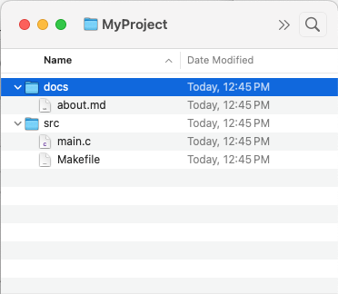

# GIT Objects

The GIT `objects` directory consists of a series of directories named 'XX', with each 'X' being a hex value from 00 to ff. Within each directory are object files, each with a 38 character file name as hex digits.

Each file contains a single GIT object.

The GIT `objects` directory also contains two additional directories: `info` and `pack`. More about that elsewhere.

- [GIT Object Names](objectnames.md)
- [GIT Object Types](objecttypes.md)
- [GIT Object Storage](objectstorage.md)
- [GIT Tree Objects](trees.md)

#### Tree objects

As mentioned above, a tree object represents the contents of a single 'directory' in the GIT storage system. Within each 'directory can be files or other directories--and when given the root 'tree' object can represent an entire directory of files in your source kit.

So, for example, suppose your source kit consisted of the following files and directories:

   

Then to represent this in your object directory you would need six separate objects:

A `tree` object representing the contents of the `MyProject` folder, which would contain two entires: one for the tree object `docs` and another for the tree object `src`.

Another `tree` object to represent the contents of the 'docs' folder, and a third for the 'src' folder.

And three `blob` objects: one for `about.md`, one for `main.c` and one for `Makefile`.

With a reference to the tree object representing `MyProject` it is then possible to decompress and write the files and directories, effectively recreating your source kit.

