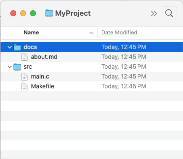

# GIT Tree objects

As mentioned [elsewhere](objecttypes.md), a tree object represents the contents of a single 'directory' in the GIT storage system. Within each 'directory can be files or other directories--and when given the root 'tree' object can represent an entire directory of files in your source kit.

So, for example, suppose your source kit consisted of the following files and directories:

   

Then to represent this in your object directory you would need six separate objects:

A `tree` object representing the contents of the `MyProject` folder, which would contain two entires: one for the tree object `docs` and another for the tree object `src`.

Another `tree` object to represent the contents of the 'docs' folder, and a third for the 'src' folder.

And three `blob` objects: one for `about.md`, one for `main.c` and one for `Makefile`.

With a reference to the tree object representing `MyProject` it is then possible to decompress and write the files and directories, effectively recreating your source kit.

## Tree Object storage

Our tree object is stored as type 'tree', meaning when stored in our object file as a single object, [the decompressed file will have the header](objectstorage.md)

    tree (size)\0

Following the null character is the contents of our tree itself.

## Tree Data Format

The tree data itself is a list of tree objects, which are stored with the following format:

    (filemode) (space) (filename) (\0) (SHA-1)

The file mode is a numeric value representing the Unix file mode used for marking the protection of a file.

**NOTE:** I did not dive too deeply into the permissions of a file. There appears to be more information out there, such as [this article](https://stackoverflow.com/questions/40978921/how-to-add-chmod-permissions-to-file-in-git), which describes one aspect of [this command.](https://git-scm.com/docs/git-update-index) The file permissions appear to be modeled after the Unix [chmod](https://en.wikipedia.org/wiki/Chmod) command.

Following the space is the name of the file itself, terminated by a null character. 

The SHA-1 of the file (which is used to identify the name of the object file in our object directory) is then stored *as a 20 byte value.*

Sample code used to read each line in the tree file in Java:

    public Record read() throws IOException
    {
        ByteArrayOutputStream baos = new ByteArrayOutputStream();
        int ch;

        /*
         *  Mode is space separated
         */

        while (-1 != (ch = in.read())) {
            if (ch == ' ') break;
            baos.write(ch);
        }
        String mode = baos.toString(StandardCharsets.UTF_8);    // always assume UTF-8

        /*
         *  Name is null terminated
         */
        baos.reset();
        while (-1 != (ch = in.read())) {
            if (ch == 0) break;
            baos.write(ch);
        }
        String name = baos.toString(StandardCharsets.UTF_8);    // always assume UTF-8

        /*
         *  SHA1 is always 20 bytes.
         */
        if (20 != in.read(buffer,0,20)) return null;

        return new Record(mode,name,buffer);
    }

This process repeats until you have reached the end of the file.
